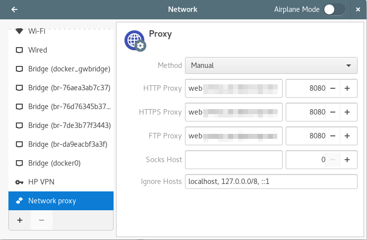

# proxyzap
A simple script/service to change Gnome3 proxy settings based on connected subnet




# Installation

* Clone the repository
```
git clone https://github.com/uggla/proxyzap.git
```

* Create the systemd service configuation directory.
```
mkdir -p  ~/.config/systemd/user
```

* Run the install.sh script. This script will create a systemd service file and link it with your systemd user settings.

* If you want proxyzap to control your dnf proxy setting, run it with:
```
sudo ./install.sh --dnfproxy
```
**NOTE: You must run the script with root privileges. It will change ownership of the dnf configuration file and will allow mode write access for the current user.**

# Service management

* Status
```
systemctl --user status proxyzap.service
```

* Start
```
systemctl --user start proxyzap.service
```

* Stop
```
systemctl --user stop proxyzap.service
```


# Configuration file

```ini
[proxyzap]
SUBGW = "192.168.0.254:proxy_profile"
ENABLEPROXYDNF = True
DEBUG = True

[proxy_profile]
PROXY = "myproxy.mydomain.local"
PROXYPORT = "8080"
PROXYIGNORE = localhost, 127.0.0.0/8, ::1
```

* SUBGW: Is the gateway off the network that requires proxy settings.
* PROXY: Proxy host name.
* PROXYPORT: Proxy port used.
* PROXYIGNORE: Hosts or subnets that do not need a proxy to connect to.
* ENABLEPROXYDNF: Enable dnf proxy control.
* DEBUG = True|False, set the log verbosity.


# Limitations
Currently it can manage only one proxy.
